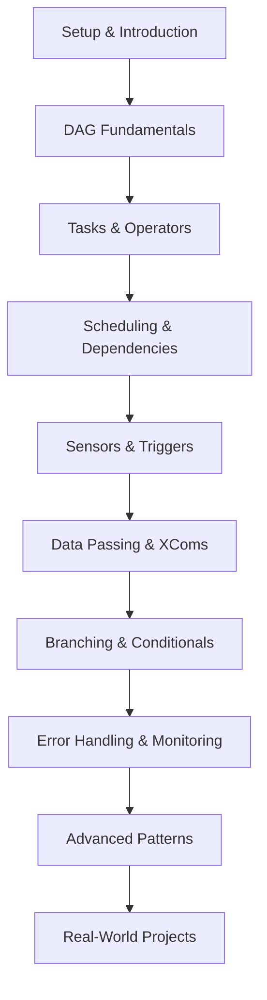

# Airflow Coding Kata Design Document

## Overview

The Airflow Coding Kata is designed as a progressive learning experience that takes developers from zero knowledge to intermediate proficiency in Apache Airflow. The kata follows a hands-on approach where learners build increasingly complex workflows while understanding core concepts through practical implementation.

The design emphasizes:

- **Progressive Learning**: Each module builds upon previous knowledge
- **Practical Application**: Real-world scenarios and exercises
- **Self-Contained**: Minimal setup requirements with Docker support
- **Reference Integration**: Seamless links to official documentation
- **Extensible Structure**: Easy to add new modules and exercises

## Architecture

### Learning Path Structure



### Directory Structure

```
airflow-coding-kata/
├── README.md                    # Main kata introduction and setup
├── docker-compose.yml           # Local Airflow environment
├── requirements.txt             # Python dependencies
├── modules/                     # Learning modules
│   ├── 01-setup/
│   ├── 02-dag-fundamentals/
│   ├── 03-tasks-operators/
│   ├── 04-scheduling-dependencies/
│   ├── 05-sensors-triggers/
│   ├── 06-data-passing-xcoms/
│   ├── 07-branching-conditionals/
│   ├── 08-error-handling/
│   ├── 09-advanced-patterns/
│   └── 10-real-world-projects/
├── dags/                        # Example and exercise DAGs
├── plugins/                     # Custom operators and hooks
├── data/                        # Sample data files
├── solutions/                   # Solution implementations
└── resources/                   # Additional learning materials
```

## Components and Interfaces

### Module Structure

Each learning module follows a consistent structure:

```
module-XX-name/
├── README.md                    # Module overview and objectives
├── concepts.md                  # Theoretical concepts explanation
├── exercises/                   # Hands-on exercises
│   ├── exercise-1.md
│   ├── exercise-2.md
│   └── ...
├── examples/                    # Working code examples
│   ├── basic_example.py
│   ├── advanced_example.py
│   └── ...
├── resources.md                 # Links and additional reading
└── solutions/                   # Exercise solutions
    ├── exercise-1-solution.py
    └── ...
```

### Exercise Types

1. **Code-Along Exercises**: Step-by-step guided implementations
2. **Challenge Exercises**: Independent problem-solving tasks
3. **Debugging Exercises**: Fix broken DAGs and identify issues
4. **Extension Exercises**: Enhance existing workflows with new features

### Learning Objectives Framework

Each module defines:

- **Learning Objectives**: What learners will accomplish
- **Prerequisites**: Required knowledge from previous modules
- **Key Concepts**: Core ideas introduced in the module
- **Practical Skills**: Hands-on abilities gained
- **Assessment Criteria**: How to verify understanding

## Data Models

### Progress Tracking

```python
@dataclass
class ModuleProgress:
    module_id: str
    title: str
    completed_exercises: List[str]
    total_exercises: int
    completion_percentage: float
    time_spent: timedelta
    last_accessed: datetime
```

### Exercise Metadata

```python
@dataclass
class Exercise:
    id: str
    title: str
    difficulty: Literal["beginner", "intermediate", "advanced"]
    estimated_time: int  # minutes
    prerequisites: List[str]
    learning_objectives: List[str]
    tags: List[str]
```

### Resource Links

```python
@dataclass
class Resource:
    title: str
    url: str
    type: Literal["documentation", "tutorial", "video", "blog"]
    difficulty: Literal["beginner", "intermediate", "advanced"]
    description: str
```

## Module Specifications

### Module 1: Setup & Introduction

- **Objective**: Environment setup and Airflow overview
- **Key Components**: Docker setup, Airflow UI tour, basic concepts
- **Deliverables**: Working Airflow instance, first "Hello World" DAG

### Module 2: DAG Fundamentals

- **Objective**: Understanding DAG structure and configuration
- **Key Components**: DAG definition, scheduling, parameters
- **Deliverables**: Multiple DAGs with different configurations

### Module 3: Tasks & Operators

- **Objective**: Task creation and operator usage
- **Key Components**: BashOperator, PythonOperator, custom operators
- **Deliverables**: DAGs with various operator types

### Module 4: Scheduling & Dependencies

- **Objective**: Task orchestration and dependency management
- **Key Components**: Task dependencies, scheduling intervals, catchup
- **Deliverables**: Complex workflows with proper dependencies

### Module 5: Sensors & Triggers

- **Objective**: Event-driven workflows and external system integration
- **Key Components**: FileSensor, S3KeySensor, custom sensors
- **Deliverables**: Reactive workflows responding to external events

### Module 6: Data Passing & XComs

- **Objective**: Inter-task communication and data flow
- **Key Components**: XCom push/pull, custom XCom backends
- **Deliverables**: Data pipeline with task communication

### Module 7: Branching & Conditionals

- **Objective**: Dynamic workflow execution
- **Key Components**: BranchPythonOperator, conditional logic
- **Deliverables**: Workflows with dynamic execution paths

### Module 8: Error Handling & Monitoring

- **Objective**: Robust workflow design and observability
- **Key Components**: Retries, callbacks, SLAs, alerting
- **Deliverables**: Production-ready workflows with error handling

### Module 9: Advanced Patterns

- **Objective**: Complex workflow patterns and optimization
- **Key Components**: SubDAGs, TaskGroups, dynamic DAG generation
- **Deliverables**: Scalable and maintainable workflow patterns

### Module 10: Real-World Projects

- **Objective**: End-to-end project implementation
- **Key Components**: ETL pipelines, API integrations, data validation
- **Deliverables**: Complete data engineering projects

## Error Handling

### Common Learning Obstacles

1. **Environment Setup Issues**

   - Docker installation problems
   - Port conflicts
   - Permission issues
   - Solution: Comprehensive troubleshooting guide with common fixes

2. **Concept Confusion**

   - DAG vs Task distinction
   - Scheduling misunderstandings
   - XCom complexity
   - Solution: Clear explanations with visual diagrams and analogies

3. **Code Errors**
   - Syntax mistakes in DAG definitions
   - Import path issues
   - Configuration errors
   - Solution: Detailed error explanations and debugging guides

### Error Recovery Strategies

- **Checkpoint System**: Save progress at module completion
- **Reset Mechanisms**: Easy way to restart exercises
- **Validation Scripts**: Automated checking of exercise completion
- **Help System**: Context-sensitive assistance and hints

## Testing Strategy

### Automated Validation

1. **DAG Validation**: Ensure all example DAGs parse correctly
2. **Exercise Verification**: Automated checking of exercise solutions
3. **Environment Testing**: Verify Docker setup works across platforms
4. **Link Validation**: Ensure all external links remain active

### Manual Testing

1. **Learning Path Validation**: Complete walkthrough by test users
2. **Difficulty Assessment**: Verify appropriate progression difficulty
3. **Time Estimation**: Validate estimated completion times
4. **Comprehension Testing**: Assess learning objective achievement

### Continuous Integration

```yaml
# Example CI pipeline
test_pipeline:
  - validate_dag_syntax
  - check_exercise_solutions
  - verify_docker_setup
  - test_external_links
  - run_learning_path_simulation
```

## Implementation Considerations

### Technology Stack

- **Documentation**: Markdown with Mermaid diagrams
- **Environment**: Docker Compose for Airflow
- **Code Examples**: Python 3.11+ with type hints
- **Validation**: pytest for automated testing

### Accessibility

- Clear, jargon-free explanations
- Multiple learning modalities (text, code, visual)
- Progressive difficulty with optional advanced sections
- Mobile-friendly documentation format

### Maintenance

- Regular updates for Airflow version compatibility
- Community contribution guidelines
- Automated link checking and content validation
- Feedback collection and incorporation process

### Extensibility

- Modular design allows easy addition of new topics
- Template structure for community contributions
- Plugin system for custom exercises
- Integration points for external learning platforms
